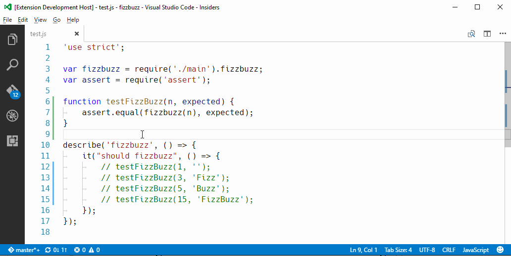
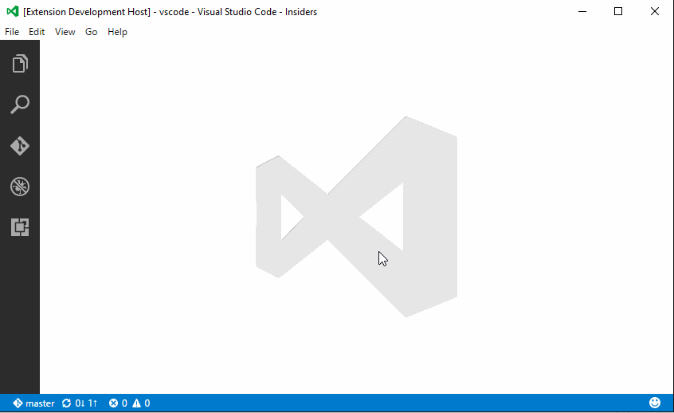

# VSCode LCOV

Renders Line and Branch coverage from `lcov.info` files interactively.

## Live coverage info



## Features

* loosely coupled, just point it to a `lcov.info` file and you're in business!
* can read multiple `lcov.info` files (e.g. one for the entire project, one for the last single test run)
* generates a Coverage Report
* supports watching certain files and executing a command (e.g. run test on file change)
* supports JavaScript source maps

## Coverage Report



This is the README for your extension "vscode-lcov". After writing up a brief description, we recommend including the following sections.

## Setting up

* There is a complete simple example at https://github.com/alexandrudima/vscode-lcov/tree/master/examples/fizzbuzz

### Get a coverage file
* There are many tools that can generate `lcov.info` files
* I have tested `lcov.info` files generated by `istanbul` e.g.
 * `istanbul cover --report lcovonly ./node_modules/mocha/bin/_mocha -- -R spec test.js`
* Configure via the setting `lcov.path`

### See the Coverage Report
 * `Ctrl+T` or `Cmd+T` then choose `Show Coverage Report`

### Live coverage
 * Configure via the setting `lcov.watch`. e.g.:
```json
"lcov.watch": [{
    "pattern": "**/*.js",
    "command": "npm run test-coverage"
}]
```
 * `Ctrl+T` or `Cmd+T` then choose `Enable watchers`

### Sourcemaps
 * JS sourcemaps support via `lcov.sourceMaps`.

### Troubleshooting
 * `View` > `Output` and choose `lcov`.

